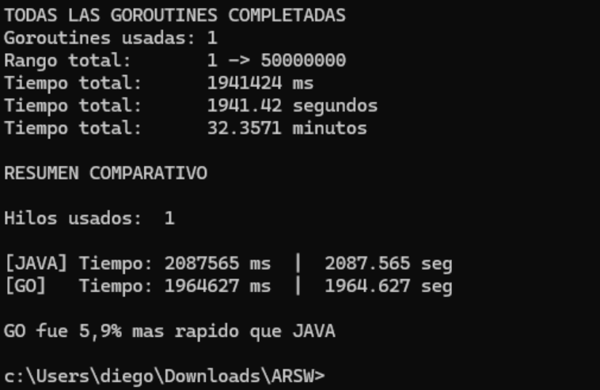
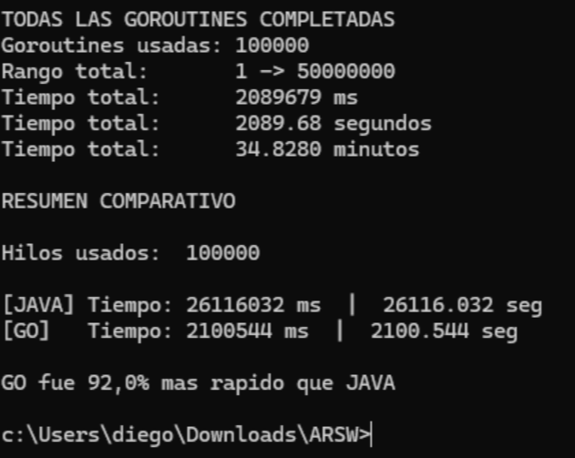
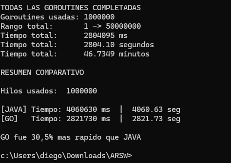

# Comparativa de Java contra Go

## Que hicimos
Hicimos una prueba practica para ver cual de los dos lenguajes es mas rapido contando numeros
El objetivo principal es que el programa cuente desde uno hasta cincuenta millones sin saltarse nada
Ademas tiene que mostrar cada numero en la pantalla para comprobar que si esta haciendo el trabajo
Lo interesante es que el usuario puede elegir cuantos hilos quiere usar para ayudar en la tarea
Al final el programa principal nos muestra los tiempos exactos que demoro cada uno
Esto nos sirve para ver cual herramienta es mejor cuando le ponemos trabajo pesado

## Como repartimos el trabajo
Para que la prueba sea justa dividimos la cantidad total de numeros entre los hilos que pidio el usuario
Asi evitamos que la computadora haga el trabajo dos veces y se confunda

| Paso del proceso | Como lo resolvimos |
| :--- | :--- |
| **Repartir los numeros** | A cada hilo se le da un numero de inicio y uno final para que trabajen por su cuenta sin pisarse entre ellos |
| **Numeros sobrantes** | Si la division de las partes no es exacta los numeros que sobran se los dejamos exclusivamente al ultimo hilo |
| **Medir los tiempos** | Tenemos un programa principal que arranca primero Java y luego Go para medir a ambos bajo las mismas reglas del juego |

## Como trabaja cada lenguaje
Cada lenguaje tiene su propia forma de crear a los hilos por debajo
Aunque ambos logran el mismo resultado el esfuerzo que hace la computadora es muy diferente

| Lenguaje | Como crea a los hilos | Como sabe que ya terminaron la tarea |
| :--- | :--- | :--- |
| **Java** | Crea hilos completos que gastan mucha mas memoria y recursos en tu computadora | El programa principal usa un comando especial para detenerse y esperar a que todos le avisen que ya terminaron |
| **Go** | Usa funciones virtuales muy rapidas que casi no pesan nada en la memoria de la maquina | Usa un contador interno que va bajando solito a medida que cada hilo va entregando su parte del trabajo |

## Que pasa si subimos la cantidad de hilos
Aqui es donde se nota de verdad la diferencia entre usar una herramienta u otra
Cuando le pedimos cosas exageradas a la maquina es cuando vemos cual esta mejor construida para no ponerse lenta

| Cantidad de hilos | Que le pasa al programa hecho en Java | Que le pasa al programa hecho en Go |
| :--- | :--- | :--- |
| **Poquitos de 1 a 10** | Funciona super bien porque la computadora tiene espacio de sobra para manejarlos a todos al mismo tiempo | Funciona muy rapido y logra hacer todo el trabajo fluidamente |
| **Muchos de 10000 a 50000** | Se vuelve muchisimo mas lento porque le cuesta demasiado esfuerzo organizar tantos procesos al mismo tiempo | Sigue funcionando muy bien porque sus hilos son super livianos y no saturan el sistema |
| **Una exageracion de 1 millon** | Le cuesta muchisimo esfuerzo y demora mas de una hora en terminar pero increiblemente logra finalizar todo el conteo sin fallar | Toma su tiempo pero avanza mucho mas rapido logrando terminar toda la tarea en menos de una hora demostrando un mejor rendimiento global |

## El problema de la pantalla
Hay un detalle final muy importante que frena bastante a los dos programas por igual
El hecho de obligar a la computadora a pintar cincuenta millones de lineas de texto en la consola hace que todo se demore
La pantalla de tu computadora siempre sera muchisimo mas lenta que el procesador interno de tu maquina
Gran parte del tiempo que demora el programa es solo esperando a que la pantalla alcance a dibujar todos los numeros
Aun asi cuando hacemos pruebas con millones de hilos es clarisimo que Go aguanta muchisimo mas castigo sin ponerse tan lento

## Resultados Reales de las Pruebas
Para demostrar todo lo anterior corrimos dos pruebas reales en la terminal
La idea fue comparar el rendimiento usando un solo hilo contra cargas masivas de cien mil y hasta un millon de hilos

| Prueba realizada | Resultado de la prueba | Conclusion del experimento |
| :--- | :--- | :--- |
| **Prueba con 1 solo hilo** | Java demoro 2087 segundos y Go demoro 1964 segundos | Al usar un solo hilo la diferencia es muy pequena logrando que Go sea apenas un seis por ciento mas rapido |
| **Prueba con 100000 hilos** | Java sufrio muchisimo demorando 26116 segundos mientras que Go demoro apenas 2100 segundos | Con cien mil procesos el peso tan grande de Java hizo que demorara siete horas mientras que Go lo resolvio en media hora logrando ser un noventa y dos por ciento mas veloz |
| **Prueba extrema con 1000000 hilos** | Java logro terminar en 4060 segundos y Go termino en 2821 segundos | Aunque parezca increible ambos programas lograron soportar un millon de procesos paralelos terminando la prueba con Go siendo un treinta por ciento mas rapido que Java |

